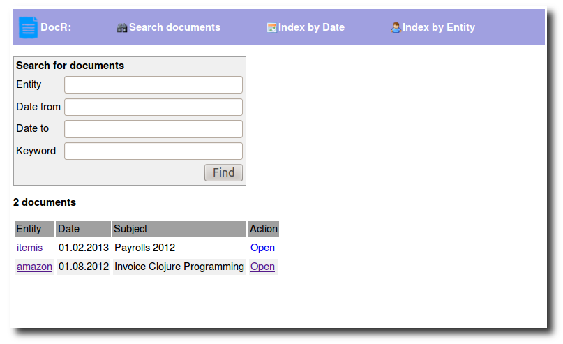

docr
====

HTTP document browser for PDFs stored on a local share, written in Clojure.

I use it in my home network to find private documents that I scanned from paper or received in PDF format. 
All documents are stored in a single folder.

The filename of each document must have the format entity\_\_date\_\_subject.pdf, where
 - entity is the name of the organization that sent me the document
 - date is the date as printed on the document, in format yyyy-mm-dd
 - subject is some description of the documents contents.

Usage
-----

To build and start DocR, clone this repo, cd into the project directory and type

    lein uberjar
    java -jar target/docr-1.0.0-standalone.jar -d ./sample-data -p 8085

Then start a web browser and enter http://localhost:8085 to open the home page of DocR.
